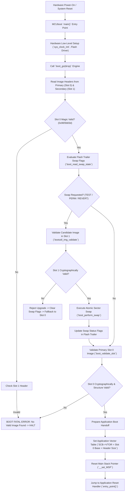
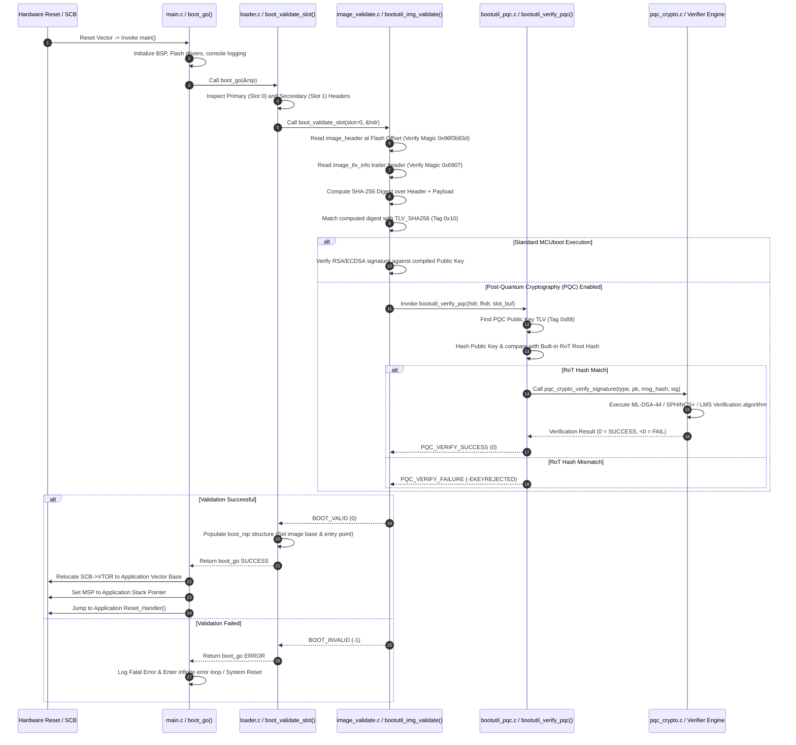

# MCUboot Deep Dive: Architecture, Codeflow & PQC Integration

**Author:** Prof. Embedded-Edu  
**Focus:** Resource-Constrained Microcontroller Secure Boot, Dual-Slot Swap Engine, and Post-Quantum Cryptography (PQC)

---

## Executive Summary & Overview

Welcome to this masterclass on **MCUboot**, the open-source secure bootloader designed specifically for resource-constrained 32-bit microcontrollers. In the ecosystem of embedded Internet of Things (IoT) devices, microcontrollers often run with minimal RAM (tens to hundreds of kilobytes) and internal flash memory (hundreds of kilobytes to a few megabytes). Operating under such tight physical constraints prohibits heavyweight operating systems or dynamic memory allocation.

MCUboot addresses this by serving as a highly deterministic, zero-heap Root of Trust (RoT). It provides image authenticity verification, fail-safe Over-The-Air (OTA) firmware upgrade capabilities via atomic dual-slot swapping, and hardware rollback protection.

This deep dive covers the architectural fundamentals of MCUboot, its execution flow from reset to application handoff, its memory layout, and how state-of-the-art **Post-Quantum Cryptography (PQC)** algorithms (NIST ML-DSA, SPHINCS+, LMS) are integrated into its verification pipeline.

---

## 1. What is MCUboot?

**MCUboot** is a lightweight, secure bootloader for 32-bit microcontrollers (ARM Cortex-M, RISC-V RV32, ESP32). It acts as the primary Stage-1 bootloader or secondary bootloader powering Real-Time Operating Systems (RTOS) like **Zephyr OS**, **NXP MCUXpresso**, **Mbed OS**, **NuttX**, and **FreeRTOS**.

```
+-------------------------------------------------------------------+
|                        MCUboot Architecture                       |
+-------------------------------------------------------------------+
|  [Zero Heap Dynamic Alloc]   [Pre-allocated Static Stack Buffers]  |
|  [Dual-Slot Flash Engine]    [Primary (Slot 0) / Secondary (Slot 1)] |
|  [Atomic Rollback System]    [Power-Cut Resilient Swap State]     |
|  [TLV Metadata Trailer]      [Type-Length-Value Img Verification] |
+-------------------------------------------------------------------+
```

### Key Technical Characteristics:
1. **Zero Heap Dynamic Allocation (`malloc`-Free)**:
   - MCUboot operates strictly using pre-allocated static stack and BSS buffers. Heap allocation is prohibited in early boot stages to prevent memory fragmentations, heap exhaustion attacks, or non-deterministic execution times.
2. **Dual-Slot Flash Partitioning**:
   - Flash memory is divided into **Primary Slot (Slot 0)**, where the active application runs in-place (XIP - Execute In Place), and **Secondary Slot (Slot 1)**, which receives OTA upgrade candidates. An optional **Scratch Slot** is used as temporary storage during sector-by-sector swapping.
3. **Atomic Image Swapping with Rollback Protection**:
   - Upgrades are swapped sector-by-sector between Slot 0 and Slot 1. If an upgraded application fails its self-test upon first boot, MCUboot automatically reverts Slot 0 back to the verified legacy application on the subsequent reset.
4. **TLV (Type-Length-Value) Metadata Trailer**:
   - Firmware image metadata (hashes, digital signatures, public keys, encryption tags) is stored in a structured TLV trailer appended directly behind the binary payload.

---

## 2. Where MCUboot is Used

MCUboot is deployed in deeply embedded environments where real-time determinism, low power consumption, and security against physical/remote threats are mandatory.

### Target Hardware Architectures:
- **ARM Cortex-M Series**: Cortex-M0+, Cortex-M3, Cortex-M4, Cortex-M7, Cortex-M33 (ARMv8-M with TrustZone).
- **RISC-V 32-bit**: RV32IMAC / RV32EMC microcontrollers (e.g., SiFive, ESP32-C3/C6).
- **Espressif Systems**: ESP32, ESP32-S3 series.

```mermaid
graph TD
    subgraph Hardware Layer ["Target Hardware Platform (ARM Cortex-M / RISC-V RV32)"]
        ROM["Stage 0 Mask ROM / Immutable Hardware RoT"]
    end

    subgraph Bootloader Layer ["MCUboot Stage 1 Execution (Internal SRAM/Flash)"]
        MCU["MCUboot Secure Bootloader"]
        Val Engine["PQC & Classic Verification Engine"]
        MCU --> Val Engine
    end

    subgraph Flash Partitions ["Flash Memory Layout"]
        Slot0["Primary Slot 0: Active Firmware (XIP)"]
        Slot1["Secondary Slot 1: OTA Candidate"]
        Scratch["Scratch Partition (Optional Swap Buffer)"]
    end

    ROM -->|"Transfer Control"| MCU
    Val Engine -->|"Validate Slot 0 / Slot 1"| Flash Partitions
    MCU -->|"Swap if valid upgrade present"| Slot0
    MCU -->|"Jump Entry Point"| App["Active RTOS Application (Zephyr / FreeRTOS)"]
```

### Typical Application Domains:
1. **Medical Telemetry & Implantable/Wearable Devices**:
   - Medical sensors require tamper-evident firmware verification and guaranteed OTA fallback to prevent device lockout during remote updates.
2. **Automotive Electronic Control Units (ECUs)**:
   - Microcontrollers on CAN/CAN-FD networks require cryptographic authentication of all incoming firmware packages.
3. **Smart Grid & Metering Infrastructure**:
   - Electricity and gas smart meters operating in physically accessible, untrusted field locations rely on MCUboot to prevent unauthorized firmware flashes.
4. **Industrial Control & Automation (PLC Sensors)**:
   - Industrial IoT edge nodes executing critical control loops under harsh real-time constraints.

---

## 3. Why MCUboot is Used

MCUboot solves critical security, operational, and memory-constraint challenges inherent to microcontrollers:

### 1. Fail-Safe Atomic Image Swapping Engine
Upgrading microcontroller firmware in the field carries severe bricking risks if power is disconnected midway through flash programming. MCUboot guards against this by using an atomic swap state machine recorded in flash trailers.

The available swap modes include:
- `BOOT_SWAP_TYPE_NONE`: Boot directly from Primary Slot 0.
- `BOOT_SWAP_TYPE_TEST`: Swap Slot 1 into Slot 0 for a single boot trial. If the new firmware fails to mark itself as "OK" (`boot_set_confirmed()`), MCUboot swaps back on the next reboot.
- `BOOT_SWAP_TYPE_PERM`: Permanently swap Slot 1 into Slot 0.
- `BOOT_SWAP_TYPE_REVERT`: Automatically trigger a reverse swap back to the legacy image.

### 2. Cryptographic Root of Trust (RoT) Security
MCUboot enforces secure boot by establishing a chain of trust. The bootloader contains embedded public keys (or hashes of public keys burned into one-time-programmable eFuses/eROM). Every image is checked for cryptographic integrity (SHA-256 digest) and authenticity (RSA, ECDSA, LMS, ML-DSA-44, SPHINCS+) before execution.

### 3. Minimal Flash & SRAM Footprint
MCUboot is engineered to fit within extremely small flash boundaries (typically 16 KB to 32 KB total code size). It runs without standard C library memory management APIs, avoiding dynamic allocation overhead entirely.

---

## 4. How MCUboot is Used & Image Layout

### Firmware Image Binary Structure

An MCUboot-compatible firmware binary is not a raw flat binary. It is formatted into three distinct contiguous sections by host utilities like `imgtool`:

```
+-------------------------------------------------------------------+
|                     MCUboot Firmware Image Layout                 |
+-------------------------------------------------------------------+
|  1. Image Header (32 Bytes)                                       |
|     - Magic: 0x96f3b83d                                           |
|     - Load Addr, Image Size, Header Size, Flags, Version          |
+-------------------------------------------------------------------+
|  2. Executable Image Payload                                      |
|     - Compiled Application Vector Table + Machine Code (.text)   |
|     - Padding to TLV alignment boundary                           |
+-------------------------------------------------------------------+
|  3. Type-Length-Value (TLV) Trailer Area                           |
|     - Header Magic: 0x6907, TLV Area Length                       |
|     - TLV Item: SHA-256 Image Hash (Tag 0x10)                     |
|     - TLV Item: Digital Signature (RSA/ECDSA/ML-DSA/SPHINCS+)     |
|     - TLV Item: Public Key / Key Hash (Tag 0x88)                  |
+-------------------------------------------------------------------+
|  4. Flash Trailer (Appended at the end of Slot 0 & Slot 1)        |
|     - Swap Status Records (Sector Copy Progress Flags)            |
|     - Copy Done Flag (0x01)                                       |
|     - Image OK Flag (0x01)                                        |
+-------------------------------------------------------------------+
```

### Detailed C Struct Definitions:

```c
/* MCUboot Image Header (32 Bytes) */
struct image_header {
    uint32_t ih_magic;         /* Magic number: IMAGE_MAGIC (0x96f3b83d) */
    uint32_t ih_load_addr;     /* Load address for non-XIP images */
    uint16_t ih_hdr_size;      /* Size of image header in bytes */
    uint16_t ih_protect_tlv_size; /* Size of protected TLV area */
    uint32_t ih_img_size;      /* Size of image payload (excluding header/TLVs) */
    uint32_t ih_flags;         /* Image flags (e.g., IMAGE_F_CONFIRMED) */
    struct image_version ih_ver; /* Semantic Versioning (Major, Minor, Revision, Build) */
    uint32_t _pad1;            /* Reserved alignment padding */
};

/* TLV Area Header */
struct image_tlv_info {
    uint16_t it_magic;         /* Magic number: IMAGE_TLV_INFO_MAGIC (0x6907) */
    uint16_t it_tlv_tot;       /* Total length of TLV area including this header */
};

/* Individual TLV Entry */
struct image_tlv {
    uint8_t  it_type;          /* TLV Type Tag (e.g., 0x10 = SHA256, 0x80 = ML-DSA-44) */
    uint8_t  _pad;             /* Alignment byte */
    uint16_t it_len;           /* Length of payload following this header */
};
```

---

## 5. Detailed Step-by-Step Codeflow Analysis & Diagrams

To understand MCUboot's internal operation, we analyze the execution pipeline from power-on hardware reset to final application vector handoff.

### 5.1 Flash Layout & Boot State Machine (Flowchart)



---

### 5.2 Detailed Codeflow Sequence Diagram

This sequence diagram traces the exact function calls across MCUboot C modules (`main.c`, `loader.c`, `image_validate.c`, `bootutil_pqc.c`, and hardware abstraction):



---

### Step-by-Step Execution Phase Breakdown

#### Phase 1: Image Header & Magic Validation
When `boot_go()` begins, MCUboot accesses the start of Slot 0 in flash. It reads the 32-byte `image_header` struct and checks `ih_magic == 0x96f3b83d`. If the magic value does not match, the slot is considered unformatted or corrupted.

#### Phase 2: TLV Parsing & Digest Computation
`bootutil_img_validate()` scans the binary past `ih_hdr_size + ih_img_size` to find the `image_tlv_info` struct (`it_magic == 0x6907`). It iterates through all TLV items in memory. It computes a SHA-256 hash over the protected image regions (`Header + Payload`) and compares the computed digest against the 32-byte SHA-256 payload stored in `IMAGE_TLV_SHA256` (Tag `0x10`).

#### Phase 3: Cryptographic Signature Verification
Once hash integrity is proven, MCUboot authenticates the image origin. In standard MCUboot, `bootutil_verify_sig()` validates RSA-2048/3072 or ECDSA P-256 signatures against public keys linked into the bootloader image. In PQC-modified MCUboot, control routes to `bootutil_verify_pqc()`.

#### Phase 4: Atomic Swap State Machine Processing
If a valid upgrade candidate exists in Secondary Slot 1 and a swap was requested, `boot_perform_swap()` initiates a sector-by-sector copy between Slot 0 and Slot 1. Scratch flash memory buffers each sector copy operation. After each sector write, swap status records are committed to flash. If power is severed during this operation, MCUboot reads the swap status flags upon reboot and resumes the exact sector transfer where it was interrupted.

#### Phase 5: Vector Table Relocation & Application Handoff
Once Slot 0 is fully validated, MCUboot prepares the ARM Cortex-M core for application handoff:
1. Disables interrupts (`__disable_irq()`).
2. Updates Vector Table Offset Register: `SCB->VTOR = (uint32_t)(Slot 0 Flash Address + Header Size)`.
3. Sets Main Stack Pointer: `__set_MSP(*(uint32_t *)(vt_addr))`.
4. Loads Reset Handler address: `void (*app_reset)(void) = (void *)(*(uint32_t *)(vt_addr + 4))`.
5. Jumps to `app_reset()`, passing total execution control to the RTOS application.

---

## 6. PQC Alterations & Modifications in MCUboot

To future-proof MCUboot against quantum computer attacks (Shor's algorithm breaking RSA/ECC), post-quantum cryptographic primitives were integrated into the bootloader codebase.

### 1. Extended TLV Tag Registry (`boot/bootutil/include/bootutil/image.h`)
To prevent collisions with legacy RSA/ECDSA tags, non-colliding PQC TLV tags were allocated in the custom range `0x80`–`0x88`:

```c
/* Post-Quantum Cryptography TLV Identifiers */
#define IMAGE_TLV_ML_DSA_44     0x80  /* NIST FIPS 204 ML-DSA-44 Signature */
#define IMAGE_TLV_SPHINCS_PLUS  0x81  /* NIST FIPS 205 SPHINCS+ Signature */
#define IMAGE_TLV_LMS           0x82  /* RFC 8554 Leighton-Micali Signature */
#define IMAGE_TLV_PQC_PUBKEY    0x88  /* PQC Public Key Container Tag */
```

### 2. Validation Hook in Core Pipeline (`boot/bootutil/src/image_validate.c`)
The validation engine was patched to invoke PQC validation when enabled via configuration flags:

```c
/* Excerpt from patched image_validate.c */
#if defined(MCUBOOT_ENABLE_PQC)
    rc = bootutil_verify_pqc(hdr, &fhdr, slot_buf);
    if (rc != 0) {
        BOOT_LOG_ERR("PQC Validation Failure on Slot %d (rc = %d)", slot, rc);
        return rc;
    }
#else
    rc = bootutil_verify_sig(hdr, &fhdr, slot_buf);
#endif
```

### 3. Stack-Optimized Verifier (`boot/bootutil/src/bootutil_pqc.c`)
Due to strict RAM limits on Cortex-M devices, PQC verification routines (such as ML-DSA-44 matrix expansions or SPHINCS+ WOTS+ hash chains) were re-engineered to operate using static stack allocations without any dynamic heap usage (`malloc`/`free`).

---

## 7. Pedagogical Review & Self-Assessment Questions

Test your understanding of MCUboot concepts and codeflow with these expert-level review questions:

1. **Q: Why does MCUboot append the image trailer (TLVs) at the end of the binary rather than putting signatures inside the header?**
   - *A*: Placing signatures in a trailer at the end allows the executable payload to remain contiguous starting directly after the 32-byte header. This allows Cortex-M hardware to execute the application directly in place (XIP) from flash without needing to copy or re-align sections in RAM.

2. **Q: What prevents an attacker from flashing a valid, signed older firmware image (rollback attack)?**
   - *A*: MCUboot enforces security version anti-rollback checks (`ih_ver`). When `MCUBOOT_HW_ROLLBACK_PROT` is enabled, MCUboot compares the candidate image version against security counter registers stored in non-volatile eFuses or protected hardware registers. If the new image version is lower than the hardware counter, MCUboot rejects the image even if its signature is cryptographically valid.

3. **Q: How does MCUboot guarantee power-cut safety during image swapping?**
   - *A*: MCUboot writes fine-grained sector swap progress markers into the Flash Trailer area of the scratch and application slots. If power is lost mid-swap, the bootloader reads the trailer markers upon reboot, detects which sector copy was in progress, and completes the atomic swap cleanly.

4. **Q: Why are PQC TLV tags assigned values like `0x80` instead of standard MCUboot tags like `0x30`?**
   - *A*: In MCUboot's standard specification, TLV tag `0x30` is assigned to `IMAGE_TLV_ENC_RSA2048` (encrypted payload metadata). Reusing `0x30` for PQC signatures would cause parser ambiguity. Assigning PQC tags to `0x80+` ensures backwards compatibility and clean tag isolation.

---
