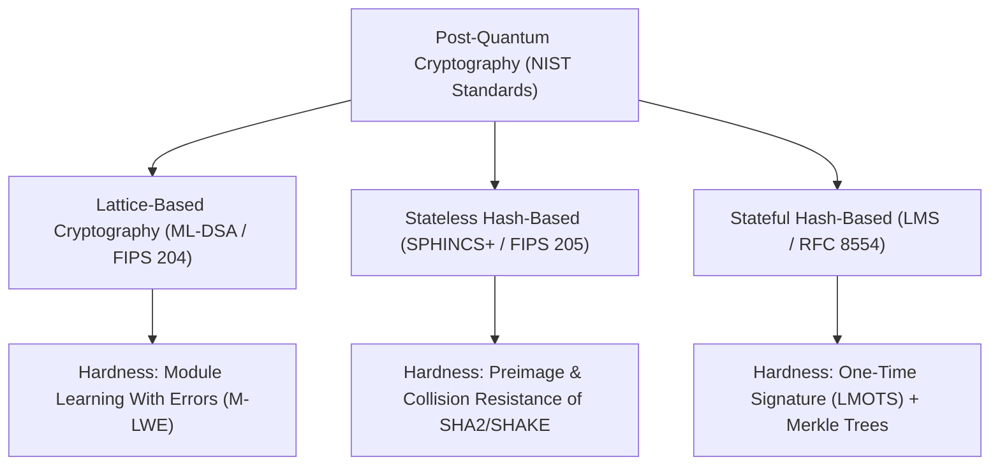

# Institutional Guide: Post-Quantum Cryptography Foundations

This document provides a deep, university-level theoretical and practical foundation for understanding **Post-Quantum Cryptography (PQC)** in secure boot applications.

---

## 1. The Quantum Threat to Classic Bootloaders

Classic secure boot mechanisms rely on public-key cryptosystems:
- **RSA-2048 / RSA-4096**: Integer Factorization Problem.
- **ECDSA (P-256, secp256k1) / Ed25519**: Discrete Logarithm Problem over Elliptic Curves.

### Shor's Algorithm Impact
A sufficiently large Quantum Computer running **Shor's Algorithm** solves both Integer Factorization and Discrete Logarithms in polynomial time:

`O((log N)^3)`

This reduces classic 2048-bit RSA or 256-bit ECDSA security from 128 bits of security down to **0 bits**, allowing attackers to derive Root-of-Trust private keys and sign malicious bootloaders.

---

## 2. NIST Post-Quantum Cryptographic Families

### 2.1 Lattice-Based Cryptography: ML-DSA-44 (NIST FIPS 204)
- **Mathematical Foundation**: Hardness of Module Learning With Errors (M-LWE) and Module Short Integer Solution (M-SIS) problems in algebraic lattices.
- **Public Key**: 1,312 bytes.
- **Signature Size**: 2,420 bytes.
- **Verification Complexity**: Matrix-vector polynomial multiplications using Number Theoretic Transform (NTT).
- **Embedded Suitability**: **Fastest verification speed** (< 5 ms @ 120 MHz), highly suited for general-purpose bootloaders.

### 2.2 Stateless Hash-Based Cryptography: SPHINCS+ (NIST FIPS 205 / SLH-DSA)
- **Mathematical Foundation**: Relies exclusively on collision-resistance and preimage-resistance of cryptographic hash functions (SHA-256 / SHAKE-256).
- **Public Key**: 32 bytes.
- **Signature Size**: 7,856 bytes (Hypertree WOTS+ and FORS signatures).
- **Embedded Suitability**: **Ultra-conservative fallback**; immune to lattice breakthroughs, but has larger signature sizes.

### 2.3 Stateful Hash-Based Cryptography: LMS / LMOTS (RFC 8554 / RFC 8708)
- **Mathematical Foundation**: Leighton-Micali One-Time Signatures (LMOTS) combined with Merkle tree authentication paths.
- **Public Key**: 56 bytes.
- **Signature Size**: 2,800 bytes.
- **Embedded Suitability**: **Ideal for ROM Bootloaders** (< 1.2 KB RAM footprint), but requires hardware NVRAM/eFuse tracking for state management.

---

## 3. Mathematical & System Trade-Off Comparison

| Metric | RSA-2048 (Classic) | ML-DSA-44 (FIPS 204) | SPHINCS+ (FIPS 205) | LMS (RFC 8554) |
| :--- | :--- | :--- | :--- | :--- |
| **Quantum Resistance** | ❌ None (Broken by Shor's) | ✅ Category 1 (128-bit) | ✅ Category 1 (128-bit) | ✅ Category 1 (128-bit) |
| **Public Key Size** | 256 B | 1,312 B | **32 B** | **56 B** |
| **Signature Size** | **256 B** | 2,420 B | 7,856 B | 2,800 B |
| **Verification Cycles** | ~3.2 M | **~0.4 M** (Fastest) | ~4.5 M | ~1.2 M |
| **SRAM Footprint** | ~0.5 KB | ~1.05 KB | ~2.2 KB | **~1.2 KB** |
| **State Risk** | None | None | None | **Stateful (OTS)** |

---

## 4. Beginner Review & Self-Assessment Questions

1. **Why does RSA fail against quantum computers while SHA-256 / AES remain secure?**
   - *Answer*: Shor's algorithm solves factorisation in polynomial time. Hash functions like SHA-256 are subject to Grover's search algorithm, which only halves quadratic brute-force security (SHA-256 retains 128 bits of quantum security).
2. **What is the digest commitment protocol in PQC Secure Boot?**
   - *Answer*: Instead of signing raw images, the bootloader computes `mu = SHA256(PK || msg)` and challenge seed `c_tilde = SHAKE256(mu, 32)`, binding the public key and message to the signature.
