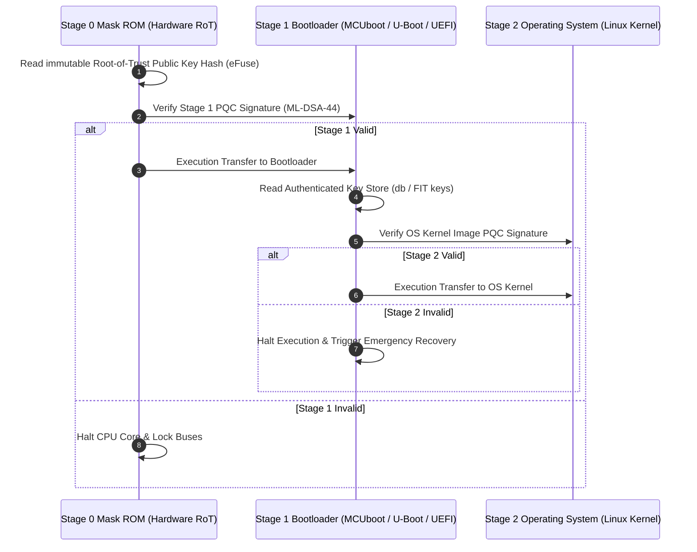

# Institutional Guide: Secure Boot Threat Model & Root of Trust

This document defines the security architecture, threat boundaries, and trust anchors for **Post-Quantum Secure Boot systems**.

---

## 1. Secure Boot Trust Chain

---

## 2. Threat Vector & Mitigation Matrix

| Threat Vector | Attack Mechanism | Countermeasure in `pqc-boot` |
| :--- | :--- | :--- |
| **Quantum Forgery** | Attackers compute classic RSA/ECC private keys using quantum hardware. | Use NIST FIPS 204 ML-DSA-44 / FIPS 205 SPHINCS+ / RFC 8554 LMS signatures. |
| **Payload Tampering** | Altering 1 bit of image binary in Flash/RAM. | SHA-256 pre-hash verification & PQC signature verification failure triggers secure boot halt. |
| **Public Key Substitution** | Attacker replaces public key in image header with their own key. | Bootloader computes `SHA256(PK)` and compares against hardware eFuse / BSS Root-of-Trust key hash. |
| **Rollback Attack** | Flashing an older, vulnerable (yet validly signed) firmware version. | Monotonic anti-rollback counters (`header_version` / security counters). |
| **Buffer Overflow** | Exploiting `malloc` heap fragmentation or dynamic memory bounds. | **Strict 100% Zero-Malloc Policy**: All memory allocated on static stack or `.bss`. |
