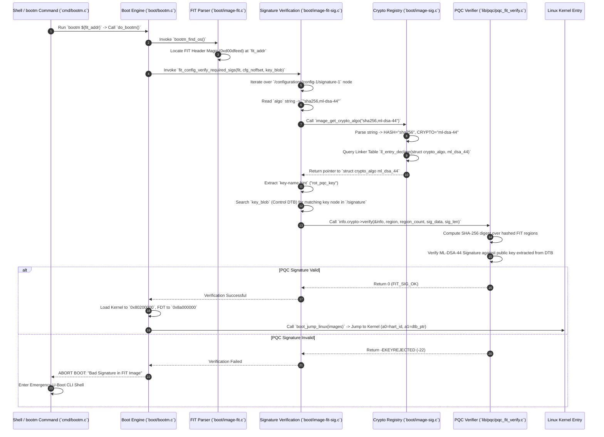

# U-Boot Deep Dive: Architecture, FIT Containers & PQC Integration

**Author:** Prof. Embedded-Edu  
**Focus:** Embedded Linux Bootloader, Multi-Stage Architecture (SPL/Proper), FIT Containers, Device Tree Binding, and Post-Quantum Signature Verification

---

## Executive Summary & Overview

**Das U-Boot** (Universal Boot Loader) is the undisputed industry standard open-source bootloader powering embedded Linux, FreeBSD, and Android systems across ARM, RISC-V, MIPS, PowerPC, and x86 hardware platforms. 

Unlike microcontroller bootloaders that run single-purpose RTOS applications in XIP mode, U-Boot operates in complex, multi-gigabyte DRAM environments. It must initialize low-level clocks, power rails, DDR memory controllers, high-speed storage interfaces (NVMe, SD/eMMC, NAND Flash), and PCIe/Ethernet controllers before parsing complex binary containers and loading multi-megabyte operating system kernels into RAM.

This deep dive examines the architecture of U-Boot, its multi-stage boot pipeline (SPL to U-Boot Proper), Flattened Image Tree (FIT) binary containers, runtime Device Tree (`.dtb`) key control, algorithm registration via C linker tables (`U_BOOT_CRYPTO_ALGO`), and the integration of **Post-Quantum Cryptography (PQC)** verification routines.

---

## 1. What is U-Boot?

**U-Boot** is a highly configurable, feature-rich Stage-2/Stage-3 bootloader for rich operating systems. It acts as the bridge between low-level hardware reset handlers and high-level OS kernels (Linux, VxWorks, Android).

```
+-------------------------------------------------------------------+
|                         U-Boot Architecture                       |
+-------------------------------------------------------------------+
|  [Multi-Stage Execution]   [SPL (SRAM) -> U-Boot Proper (DRAM)]   |
|  [Flattened Image Tree]    [FIT (.itb) Container Specification]   |
|  [Driver Model (DM)]       [UCLASS Modular Hardware Abstraction]  |
|  [Crypto Linker Tables]    [U_BOOT_CRYPTO_ALGO Macro Registry]    |
+-------------------------------------------------------------------+
```

### Key Technical Characteristics:
1. **Multi-Stage Execution Model**:
   - **TPL/VPL (Tertiary/Verification Program Loader)**: Optional early stage for secure boot validation or DRAM initialization.
   - **SPL (Secondary Program Loader)**: Tiny footprint binary (16 KB–64 KB) executing in internal SRAM to initialize system clocks, PMIC, and DDR memory controllers.
   - **U-Boot Proper**: Full-featured bootloader binary executing in main DRAM with interactive Shell CLI, network stack, and filesystem support.
2. **Flattened Image Tree (FIT) Container Format**:
   - Replaces legacy single-binary `uImage` containers with a flexible Device Tree binary format (`.itb`). FIT encapsulates Linux kernel binaries, Flattened Device Trees (FDT/DTB), Initrd/Ramdisks, system overlays, and cryptographic signatures within a single unified container.
3. **Control Device Tree & Public Key Storage**:
   - U-Boot Proper embeds a compiled control device tree (`u-boot.dtb`). Public verification keys used to authenticate FIT images are compiled directly into the control DTB under the `/signature` node.
4. **Linker-Table Cryptographic Registry**:
   - Crypto algorithms (SHA-256, RSA, ECDSA, ML-DSA, SPHINCS+) register themselves into dedicated ELF linker sections using the `U_BOOT_CRYPTO_ALGO` macro, enabling modular, runtime lookup without monolithic `switch-case` blocks.

---

## 2. Where U-Boot is Used

U-Boot is deployed across enterprise, industrial, and consumer embedded systems running Linux or BSD kernels.

### Target Hardware Architectures:
- **64-bit RISC-V (RV64GC)**: SiFive Freedom U740, StarFive JH7110 (VisionFive 2), Milk-V Pioneer, QEMU `virt` RISC-V 64.
- **64-bit ARM (AArch64)**: ARM Cortex-A53/A72/A76 platforms (e.g., Raspberry Pi 4/5, NXP i.MX8M, Rockchip RK3399/RK3588, Allwinner H6).
- **32-bit ARM (ARMv7-A)**: Cortex-A7/A9 platforms (e.g., NXP i.MX6, TI AM335x BeagleBone).

```mermaid
graph TD
    subgraph Hardware ["Hardware Reset Layer"]
        BootROM["Stage 0 Mask ROM"]
    end

    subgraph SRAM Phase ["Internal SRAM Stage"]
        SPL["Stage 1: U-Boot SPL"]
        DDR_Init["DDR Memory Controller Init"]
        SPL --> DDR_Init
    end

    subgraph DRAM Phase ["Main System DRAM Stage"]
        Proper["Stage 2: U-Boot Proper"]
        FIT["FIT Container (.itb) Parser"]
        ControlDTB["Embedded u-boot.dtb (Public Key Store)"]
        Proper --> FIT
        Proper --> ControlDTB
    end

    subgraph Kernel Space ["Operating System Space"]
        Kernel["Linux Kernel (Image/zImage)"]
        FDT["System Device Tree (dtb)"]
        Initrd["Root Filesystem (ramdisk)"]
    end

    BootROM -->|"Load SPL to SRAM"| SPL
    DDR_Init -->|"Relocate & Boot Proper"| Proper
    FIT -->|"Verify PQC Signature vs Control DTB"| PQC{"Signature Valid?"}
    PQC -- Yes -->|"Handoff OS Arguments"| Kernel
    PQC -- Yes --> FDT
    PQC -- Yes --> Initrd
    PQC -- No --> Trap["Security Trap / Emergency Shell"]
```

### Typical Application Domains:
1. **Edge AI Systems & RISC-V Compute Nodes**: Single Board Computers (SBCs) loading Linux kernels and neural processing drivers.
2. **Automotive In-Vehicle Infotainment (IVI)**: High-performance SoC platforms running Linux/Android requiring fast-boot and secure signed updates.
3. **Networking Gear & Gateways**: Enterprise routers, WiFi 6/7 access points, and industrial IoT edge gateways.
4. **Aerospace & Defense Edge Processors**: Hardened single-board computers demanding cryptographically verified OS loading.

---

## 3. Why U-Boot is Used

### 1. Flattened Image Tree (FIT) Security Architecture
Legacy bootloader formats (`uImage`) suffered from limited metadata and rigid single-image constraints. FIT images use Device Tree Syntax (`.its` source, `.itb` compiled binary), allowing multiple configurations (e.g., Production Kernel, Debug Kernel, Recovery Kernel) paired with appropriate device trees and ramdisks in one authenticated package.

### 2. Flexible Device Tree Binding
U-Boot decouples hardware drivers from bootloader source code by utilizing Device Tree Blobs (DTB). System peripherals, memory maps, pin control, and cryptographic key stores are parsed at runtime from the DTB.

### 3. Dynamic Linker Table Extensibility (`U_BOOT_CRYPTO_ALGO`)
U-Boot uses custom linker sections to construct arrays of available cryptographic algorithms at compile time. Adding a new post-quantum signature algorithm does not require modifying core boot loop code; developers simply declare a new `U_BOOT_CRYPTO_ALGO()` structure instance.

---

## 4. How U-Boot is Used & FIT Container Structure

### FIT Image Specification (`.its` Source File Example)

```dts
/dts-v1/;

/ {
    description = "PQC-Authenticated RISC-V 64 Linux FIT Image";
    #address-cells = <1>;

    images {
        kernel-1 {
            description = "Linux Kernel 6.6 AArch64 / RV64";
            data = /incbin/("./Image.gz");
            type = "kernel";
            arch = "riscv";
            os = "linux";
            compression = "gzip";
            load = <0x80200000>;
            entry = <0x80200000>;
            hash-1 {
                algo = "sha256";
            };
        };

        fdt-1 {
            description = "Target System Device Tree (jh7110-visionfive-v2.dtb)";
            data = /incbin/("./jh7110-visionfive-v2.dtb");
            type = "flat_dt";
            arch = "riscv";
            compression = "none";
            load = <0x8a000000>;
            hash-1 {
                algo = "sha256";
            };
        };
    };

    configurations {
        default = "config-1";
        config-1 {
            description = "Standard PQC Boot Configuration";
            kernel = "kernel-1";
            fdt = "fdt-1";
            signature-1 {
                algo = "sha256,ml-dsa-44";
                key-name-hint = "rot_pqc_key";
                sign-images = "kernel", "fdt";
            };
        };
    };
};
```

### Building & Signing FIT Containers:
Host systems use U-Boot's `mkimage` utility to build the `.itb` binary and inject public verification keys into U-Boot's control device tree (`u-boot.dtb`):

```bash
# 1. Compile FIT Image and sign with private PQC key
mkimage -f fit_image.its -k /keys/pqc_private_keys -K u-boot.dtb -r fitImage.itb

# 2. Compile U-Boot with embedded signed u-boot.dtb
make CROSS_COMPILE=riscv64-linux-gnu- DEVICE_TREE=u-boot
```

---

## 5. Detailed Step-by-Step Codeflow Analysis & Diagrams

### 5.1 Multi-Stage Execution Pipeline (Flowchart)

```mermaid
flowchart TD
    A["System Power On / Hard Reset"] --> B["Stage 0: Processor Mask ROM"]
    B --> C["Load U-Boot SPL into Internal SRAM"]
    
    subgraph SPL ["Stage 1: U-Boot SPL Execution (SRAM)"]
        C --> D["`board_init_f()`: Clocks, PMIC, Console Init"]
        D --> E["`dram_init()`: DDR Training & Calibration"]
        E --> F["`board_init_r()`: Storage Driver Setup (SD/eMMC/NVMe)"]
        F --> G["Load U-Boot Proper from Flash/Storage into DRAM"]
    end

    G --> H["Jump to U-Boot Proper Entry Point (`_start`)"]

    subgraph Proper ["Stage 2: U-Boot Proper Execution (DRAM)"]
        H --> I["`board_init_f()`: Relocate U-Boot to Top of DRAM"]
        I --> J["`board_init_r()`: Init Driver Model (DM), Net, USB, PCIe"]
        J --> K["`main_loop()`: Auto-boot Countdown & Command Shell"]
        K --> L["Execute `bootm` Command (`do_bootm`)"]
    end

    L --> M["Parse FIT Image Structure (`fit_parse`)"]
    M --> N["Call `fit_config_verify_required_sigs()`"]
    
    N --> O["Locate Public Key in `u-boot.dtb` under `/signature` node"]
    O --> P["Invoke Linker Table Crypto Alg (`image_get_crypto_algo`)"]
    
    P --> Q{"Signature & Hash Valid?"}
    Q -- No --> R["FATAL SECURITY ERROR: Signature Verification Failed -> ABORT"]
    Q -- Yes --> S["Uncompress Kernel & Load into Memory Target Address"]
    S --> T["Relocate Flattened Device Tree (FDT) & Setup Register Arguments"]
    T --> U["Jump to Kernel Entry (`boot_jump_linux`)"]
```

---

### 5.2 Detailed Codeflow Sequence Diagram

This sequence diagram details function calls between core U-Boot commands (`cmd/bootm.c`), FIT image parsers (`boot/image-fit.c`), signature verification drivers (`boot/image-fit-sig.c`, `boot/image-sig.c`), and PQC verification backends (`lib/pqc/pqc_fit_verify.c`):



---

### Step-by-Step Execution Phase Breakdown

#### Phase 1: SPL Initialization (Stage 1)
Upon power-on reset, CPU execution starts in Mask ROM, which loads U-Boot SPL into internal SRAM (L2 cache-as-RAM or SRAM). SPL executes `board_init_f()`, initializing low-level clocks, power management ICs (PMICs), and UART debugging. It then calls `dram_init()` to run DDR PHY calibration routines. Once DRAM is online, SPL reads U-Boot Proper from storage (eMMC/Flash) into DRAM and jumps to `_start`.

#### Phase 2: U-Boot Proper Relocation & Command Execution (Stage 2)
U-Boot Proper executes in DRAM. It relocates its own binary code to the top of available physical RAM to reserve lower memory for OS kernels. It initializes the Driver Model (DM) framework, storage stacks, and Ethernet drivers. Finally, it enters `main_loop()`, executing the automated boot script (`bootcmd`), which triggers `bootm`.

#### Phase 3: FIT Image Header Parsing & Node Extraction
`do_bootm()` receives the memory location of the FIT container. `fit_parse()` checks the Flattened Device Tree header magic (`0xd00dfeed`). The parser traverses the `/images` and `/configurations` trees, reading property keys like `kernel`, `fdt`, `ramdisk`, and `signature-1`.

#### Phase 4: Linker-Table Algorithm Lookup (`image_get_crypto_algo`)
When `fit_config_verify_required_sigs()` detects `algo = "sha256,ml-dsa-44"`, it calls `image_get_crypto_algo()`. This function splits the string at the comma delimiter into hashing algorithm (`sha256`) and signature algorithm (`ml-dsa-44`). It then iterates through the compiled linker table array `_u_boot_list_2_crypto_algo_2_*` to find the registered `struct crypto_algo` instance.

#### Phase 5: Cryptographic Verification & Control DTB Key Extraction
The verifier locates the public key in U-Boot's control device tree (`u-boot.dtb`) by matching `key-name-hint = "rot_pqc_key"`. The PQC verification callback (`ml_dsa_44_verify()`) hashes the specified FIT image regions and validates the ML-DSA-44 signature against the DTB key.

#### Phase 6: OS Handoff & Architecture Register Setup
Upon successful verification, U-Boot uncompresses the kernel payload into its specified load address (`0x80200000`). It updates the OS device tree with memory maps and kernel command-line arguments (`chosen` node). Finally, `boot_jump_linux()` disables CPU caches, sets target registers (for RISC-V 64: `a0 = hart_id`, `a1 = dtb_address`), and branches execution directly into the Linux kernel entry point.

---

## 6. PQC Alterations & Modifications in U-Boot

Integrating Post-Quantum Cryptography into U-Boot requires extending FIT signature specifications and registering new algorithm handlers.

### 1. `U_BOOT_CRYPTO_ALGO` Registration (`lib/pqc/pqc_fit_verify.c`)
U-Boot uses macro declarations to register crypto handlers. PQC algorithms are registered into U-Boot's linker table as follows:

```c
/* Register ML-DSA-44 Algorithm into U-Boot Linker Array */
U_BOOT_CRYPTO_ALGO(ml_dsa_44) = {
    .name = "ml-dsa-44",
    .key_len = ML_DSA_44_PUBLIC_KEY_BYTES, /* 1312 Bytes */
    .sig_len = ML_DSA_44_SIG_BYTES,        /* 2420 Bytes */
    .checksum = &image_checksum_algos[0],  /* SHA-256 */
    .verify = pqc_fit_verify_mldsa44,
};

/* Register SPHINCS+ Algorithm */
U_BOOT_CRYPTO_ALGO(sphincs_plus) = {
    .name = "sphincs-plus",
    .key_len = SPHINCS_PLUS_PK_BYTES,
    .sig_len = SPHINCS_PLUS_SIG_BYTES,
    .checksum = &image_checksum_algos[0],
    .verify = pqc_fit_verify_sphincs_plus,
};
```

### 2. Control DTB Public Key Node Format
Host tools inject public key nodes into `u-boot.dtb` under the `/signature` tree:

```dts
/ {
    signature {
        key-rot_pqc_key {
            required = "conf";
            algo = "sha256,ml-dsa-44";
            rsa,r-squared = <...>; /* Omitted for PQC */
            pqc,public-key = /incbin/("./mldsa44_pubkey.bin");
        };
    };
};
```

### 3. Host-Side `mkimage` Integration (`tools/image-sig-host.c`)
To enable host systems to build signed FIT containers, PQC signature generation routines were linked into U-Boot's host tool compilation rules in `tools/Makefile`.

---

## 7. Pedagogical Review & Self-Assessment Questions

1. **Q: What is the primary operational difference between U-Boot SPL and U-Boot Proper?**
   - *A*: U-Boot SPL runs early in SRAM before system DRAM is available; its sole responsibility is initializing basic hardware, DDR memory controllers, and loading U-Boot Proper into DRAM. U-Boot Proper executes in DRAM with a full driver model, environment shell, network/storage stacks, and FIT signature verification engine.

2. **Q: How does `image_get_crypto_algo()` find signature verifiers without using hardcoded `if-else` blocks?**
   - *A*: U-Boot uses linker section macros (`U_BOOT_CRYPTO_ALGO`). At compile time, the linker places all declared `struct crypto_algo` structures into a contiguous array (`_u_boot_list_2_crypto_algo_2_*`). `image_get_crypto_algo()` iterates through this array at runtime, matching algorithm name strings.

3. **Q: Where are public verification keys stored in U-Boot Secure Boot?**
   - *A*: Public verification keys are embedded directly inside U-Boot Proper's control device tree (`u-boot.dtb`) under the `/signature` root node.

4. **Q: Why is FIT Image (`.itb`) superior to legacy `uImage` for secure boot deployments?**
   - *A*: Legacy `uImage` only supported a single binary payload with a simple CRC32 checksum. FIT images use Device Tree syntax to bundle multiple kernels, device trees, and ramdisks, allowing cryptographic signatures to cover combinations of configuration nodes (e.g., verifying that kernel X is booted with authentic device tree Y).

---
