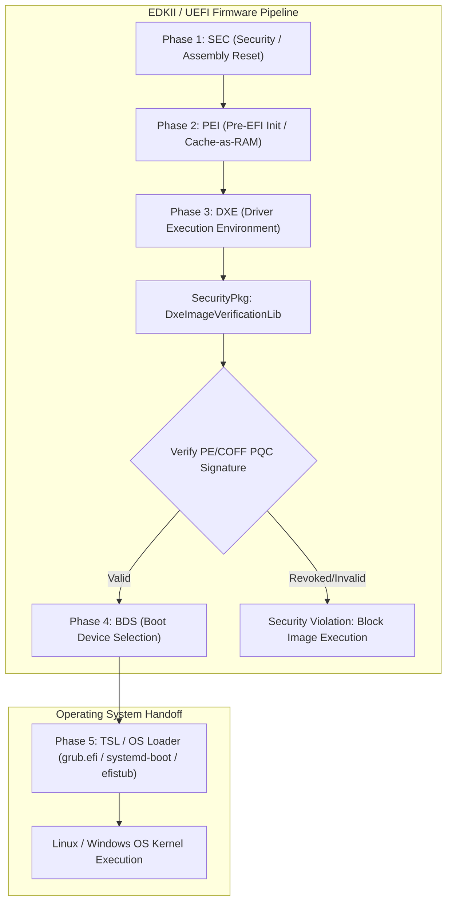
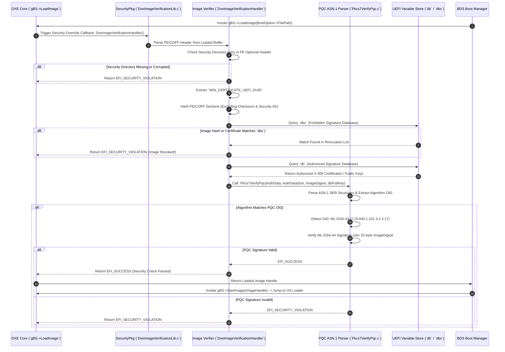

# EDKII / UEFI Deep Dive: SecurityPkg, DXE & PQC Integration

**Author:** Prof. Embedded-Edu  
**Focus:** Enterprise Firmware Infrastructure, TianoCore EDKII, PE/COFF Executable Validation, SecurityPkg, PKCS#7/X.509 OID Parsing, and Post-Quantum Cryptography

---

## Executive Summary & Overview

The **Unified Extensible Firmware Interface (UEFI)** and its reference open-source implementation, **TianoCore EDKII (EFI Development Kit II)**, define the standard firmware infrastructure powering modern enterprise servers, cloud hypervisors, workstations, and high-performance ARM 64-bit systems.

Unlike monolithic or RTOS bootloaders, UEFI is a modular, event-driven operating environment in its own right. It provides standardized abstractions (UEFI Protocols, Boot Services, Runtime Services), ACPI table generation, hardware discovery, and cryptographic image validation for PE/COFF (`.efi`) binaries before handing off control to OS bootloaders (`grub2`, `systemd-boot`, Windows Boot Manager).

This deep dive covers EDKII's execution lifecycle across its distinct boot phases (SEC, PEI, DXE, BDS, TSL, RT), the architecture of `SecurityPkg` and `DxeImageVerificationLib`, UEFI Key Databases (`PK`, `KEK`, `db`, `dbx`), ASN.1 / PKCS#7 Object Identifier (OID) parsing, and the integration of **Post-Quantum Cryptography (PQC)** verifiers.

---

## 1. What is EDKII / UEFI?

**EDKII** is the industry-standard, cross-platform open-source C framework implementing the UEFI Specification.

```
+-------------------------------------------------------------------+
|                        EDKII / UEFI Architecture                  |
+-------------------------------------------------------------------+
|  [Modular Boot Pipeline]   [SEC -> PEI -> DXE -> BDS -> TSL]       |
|  [PE/COFF Executable]      [.efi Executable Binary Specification]  |
|  [Authenticated Variable]  [PK, KEK, db, dbx Security Stores]       |
|  [PKCS#7 / X.509 Engine]   [DxeImageVerificationLib & ASN.1 OIDs]  |
+-------------------------------------------------------------------+
```

### Key Technical Characteristics:
1. **Modular Multi-Phase Execution Pipeline**:
   - Firmware execution progresses through strict, isolated phases: **SEC** (Security), **PEI** (Pre-EFI Initialization), **DXE** (Driver Execution Environment), **BDS** (Boot Device Selection), **TSL** (Transient System Load), **RT** (Runtime), and **AL** (After Life).
2. **PE/COFF Executable Format (`.efi`)**:
   - All UEFI drivers, applications, and OS loaders are compiled as Portable Executable / Common Object File Format binaries (PE32+ / PE/COFF). Security signatures are embedded inside the PE/COFF Security Directory header container (`WIN_CERTIFICATE_UEFI_GUID`).
3. **UEFI Authenticated Key Databases**:
   - **Platform Key (`PK`)**: Establishes ownership between platform manufacture/owner and firmware.
   - **Key Exchange Key (`KEK`)**: Authorizes updates to the signature databases.
   - **Authorized Signature Database (`db`)**: Contains trusted X.509 certificates, public key hashes, or image digests allowed to execute.
   - **Forbidden Signature Database (`dbx`)**: Contains revoked certificates or compromised image hashes blocked from executing.
4. **`SecurityPkg` Architecture**:
   - UEFI Secure Boot is implemented inside EDKII's `SecurityPkg` package. The `DxeImageVerificationLib` library registers an override callback with the DXE Core to intercept all `gBS->LoadImage()` requests and validate binaries against `db` and `dbx`.

---

## 2. Where EDKII / UEFI is Used

EDKII / UEFI is the primary boot infrastructure for enterprise server hardware, desktop/laptop systems, and multi-core ARM 64-bit platforms.

### Target Hardware Architectures:
- **ARM 64-bit (AArch64)**: ARM Neoverse enterprise cores, Ampere Altra / eMAG servers, QEMU `virt` AArch64, ARM Cortex-A SMP platforms (Cortex-A55/A76/A78).
- **x86_64 / x86**: Intel Xeon, AMD EPYC, Intel Core, AMD Ryzen processors.
- **RISC-V 64-bit**: EDKII RISC-V ports (QEMU `virt` RISC-V 64, Freedom U740).



### Typical Application Domains:
1. **Enterprise Cloud & Data Center Servers**: Hyperscale infrastructure requiring Secure Boot compliance, TPM 2.0 attestation, and remote management (IPMI/Redfish).
2. **ARM Cortex-A Multi-Core SMP Systems**: High-density ARM server nodes requiring ACPI table configuration and PCI Express enumeration.
3. **Virtualization & Confidential Computing (Tee/SEV/TDX)**: Virtual Machines (QEMU/KVM OVMF images) enforcing Secure Boot across tenant workloads.

---

## 3. Why EDKII / UEFI is Used

### 1. Standardized Security Framework (`SecurityPkg`)
UEFI Secure Boot establishes an industry-standard mechanism to prevent rootkits and bootkits from loading during platform startup. Every executable binary loaded by `gBS->LoadImage()` is authenticated against authenticated non-volatile flash variables (`db`/`dbx`).

### 2. PKCS#7 / X.509 Cryptographic Standard & ASN.1 OIDs
UEFI uses PKCS#7 SignedData structures containing X.509 certificates. Cryptographic signature and hash algorithms are identified using Object Identifiers (OIDs) encoded in ASN.1 DER (Distinguished Encoding Rules). This standardized structure allows adding new signature schemes without changing the underlying PE/COFF header format.

### 3. Rich Protocol-Based Driver Model
DXE drivers produce and consume **UEFI Protocols** (structs containing function pointers identified by GUIDs). Drivers interact via clean interfaces (e.g., `gBS->LocateProtocol()`), avoiding direct hardware register manipulation across different software layers.

---

## 4. How EDKII / UEFI is Used & PE/COFF Security Header Structure

### PE/COFF Image Security Container (`WIN_CERTIFICATE`)

When a `.efi` binary is signed, the signature payload is inserted into the Security Directory of the PE/COFF Optional Header:

```
+-------------------------------------------------------------------+
|                  PE/COFF Binary Format (.efi)                     |
+-------------------------------------------------------------------+
|  1. DOS Header & PE Signature ("PE\0\0")                          |
+-------------------------------------------------------------------+
|  2. COFF File Header & Optional Header                            |
|     - AddressOfEntryPoint                                         |
|     - Data Directories -> Security Directory Pointer & Size       |
+-------------------------------------------------------------------+
|  3. Section Headers (.text, .data, .reloc, .rdata)                |
+-------------------------------------------------------------------+
|  4. Executable Section Payloads                                   |
+-------------------------------------------------------------------+
|  5. Attribute Certificate Table (WIN_CERTIFICATE)                 |
|     - dwLength: Total Certificate Container Size                   |
|     - wRevision: WIN_CERT_REVISION_2_0 (0x0200)                   |
|     - wCertificateType: WIN_CERT_TYPE_EFI_GUID (0x0EF1)           |
|     - certType: gEfiCertPkcs7Guid / gEfiCertPqcGuid                |
|     - CertData[]: Raw PKCS#7 SignedData Container                 |
+-------------------------------------------------------------------+
```

### C Struct Definitions (`SecurityPkg/Include/Guid/WinCertificate.h`):

```c
typedef struct {
    UINT32  dwLength;          /* Length of entire certificate container */
    UINT16  wRevision;         /* Certificate Revision (0x0200) */
    UINT16  wCertificateType;  /* WIN_CERT_TYPE_EFI_GUID (0x0EF1) */
    EFI_GUID certType;         /* GUID identifying certificate format */
    UINT8    bCertificate[1];  /* Start of PKCS#7 / PQC SignedData payload */
} WIN_CERTIFICATE_UEFI_GUID;
```

---

## 5. Detailed Step-by-Step Codeflow Analysis & Diagrams

### 5.1 EDKII 7-Phase Execution Lifecycle (Flowchart)

```mermaid
flowchart TD
    A["Hardware Power-On / System Reset"] --> Phase1

    subgraph Phase1 ["1. SEC Phase (Security)"]
        B["Reset Vector (`ResetHandler`)"] --> C["Assembly Execution & Flat Mode Setup"]
        C --> D["Initialize Cache-as-RAM (CAR / Temporary RAM)"]
        D --> E["Establish Early Root of Trust Anchor"]
    end

    Phase1 --> Phase2

    subgraph Phase2 ["2. PEI Phase (Pre-EFI Initialization)"]
        F["`PeiMain()` Core Entry Point"] --> G["Dispatch PEIM Drivers (Pre-EFI Initialization Modules)"]
        G --> H["Execute Memory Controller Initialization (DRAM Discovery)"]
        H --> I["Migrate Stack from CAR to Permanent DRAM"]
    end

    Phase2 --> Phase3

    subgraph Phase3 ["3. DXE Phase (Driver Execution Environment)"]
        J["`DxeMain()` Execution"] --> K["Initialize Architectural Protocols (gBS, gRT)"]
        K --> L["Dispatch DXE Bus, Storage, & Peripheral Drivers"]
        L --> M["Register `DxeImageVerificationLib` Override Callback"]
    end

    Phase3 --> Phase4

    subgraph Phase4 ["4. BDS Phase (Boot Device Selection)"]
        N["`BdsEntry()` Execution"] --> O["Enumerate PCI Express Devices & Boot Options"]
        O --> P["Invoke `gBS->LoadImage()` on Selected Boot Option (`grub.efi`)"]
        P --> Q["Security Verification Callback (`DxeImageVerificationHandler`)"]
    end

    Q --> R{"Signature Verified in `db`?"}
    R -- Revoked/Invalid --> S["EFI_SECURITY_VIOLATION: Abort Loading Binary"]
    R -- Valid --> Phase5

    subgraph Phase5 ["5. TSL Phase (Transient System Load)"]
        T["Execute OS Loader Binary (`grub.efi`)"] --> U["OS Loader Calls `gBS->ExitBootServices()`"]
    end

    Phase5 --> Phase6

    subgraph Phase6 ["6. RT Phase (Runtime)"]
        V["Reclaim Boot Services Memory"] --> W["Hand Over Control to Operating System Kernel"]
    end
```

---

### 5.2 Detailed Codeflow Sequence Diagram

This sequence diagram traces function execution when `gBS->LoadImage()` is invoked to load an OS bootloader binary, detailing interaction between DXE Core, `SecurityPkg/DxeImageVerificationLib`, and PQC PKCS#7 verifiers:



---

### Step-by-Step Execution Phase Breakdown

#### Phase 1: SEC Phase (Security)
Platform reset initializes the CPU. Execution begins at the assembly `ResetHandler()`. The SEC phase configures temporary memory by setting up Cache-as-RAM (CAR) before physical DRAM is available. It establishes the initial hardware Root of Trust anchor (such as verifying the PEI Core binary) and transitions execution to `PeiMain()`.

#### Phase 2: PEI Phase (Pre-EFI Initialization)
The PEI phase uses small, specialized drivers called Pre-EFI Initialization Modules (PEIMs). PEIMs initialize system clocks, power rails, and the memory controller (DDR training). Once physical DRAM is online, PEI migrates its stack from CAR into DRAM, builds Memory Resource Descriptor HOBs (Hand-Off Blocks), and passes control to `DxeMain()`.

#### Phase 3: DXE Phase (Driver Execution Environment)
The DXE phase initializes core UEFI services: **Boot Services (`gBS`)** and **Runtime Services (`gRT`)**. The DXE Dispatcher discovers and loads DXE drivers from Firmware Volumes (FVs). During this phase, `SecurityPkg` initializes `DxeImageVerificationLib`, registering a security override callback to monitor all binary image loading operations.

#### Phase 4: SecurityPkg Override & PE/COFF Verification
When `gBS->LoadImage()` is called (e.g., loading `grub.efi`), execution is intercepted by `DxeImageVerificationHandler()`. The verification flow proceeds as follows:
1. **PE/COFF Parsing**: Verifies PE header headers and extracts section tables.
2. **Authenticode Hashing**: Computes a SHA-256 digest over the PE/COFF sections while skipping the PE Checksum field and the Security Directory entry.
3. **Revocation Check (`dbx`)**: Checks if the image digest or signing certificate is listed in the `dbx` variable. If matched, execution is immediately blocked.
4. **Authorization Check (`db`)**: Locates the signing certificate or public key in the `db` variable.
5. **ASN.1 / PKCS#7 Verification**: Passes the `WIN_CERTIFICATE` payload to `Pkcs7Verify()` / `Pkcs7VerifyPqc()` to parse algorithm OIDs and validate the signature.

#### Phase 5: BDS Phase (Boot Device Selection) & OS Handoff
Once image authentication succeeds, control transitions to `BdsEntry()`. BDS parses UEFI Boot Options (`Boot0001`, `BootOrder`), connects console and storage drivers, loads the selected OS bootloader via `gBS->StartImage()`, and executes `grub.efi` or `systemd-boot`. The OS loader invokes `gBS->ExitBootServices()`, terminating UEFI Boot Services and handing control over to the OS kernel.

---

## 6. PQC Alterations & Modifications in EDKII / UEFI

Integrating Post-Quantum Cryptography into UEFI required defining new ASN.1 Object Identifiers (OIDs), extending `SecurityPkg`, and implementing static-memory verifier libraries.

### 1. PQC Object Identifiers (OIDs) Defined (`SecurityPkg/Include/Guid/PqcVerify.h`)
Standard ASN.1 OIDs were defined for post-quantum algorithms following NIST FIPS standards:

```c
/* NIST FIPS 204 ML-DSA-44 OID: 2.16.840.1.101.3.4.3.17 */
STATIC CONST UINT8 mOidMlDsa44[] = {
    0x60, 0x86, 0x48, 0x01, 0x65, 0x03, 0x04, 0x03, 0x11
};

/* NIST FIPS 205 SPHINCS+ OID: 2.16.840.1.101.3.4.3.20 */
STATIC CONST UINT8 mOidSphincsPlus[] = {
    0x60, 0x86, 0x48, 0x01, 0x65, 0x03, 0x04, 0x03, 0x14
};

/* RFC 8708 LMS OID: 1.2.840.113549.1.9.16.3.17 */
STATIC CONST UINT8 mOidLms[] = {
    0x2A, 0x86, 0x48, 0x86, 0xF7, 0x0D, 0x01, 0x09, 0x10, 0x03, 0x11
};
```

### 2. Integration in `DxeImageVerificationLib.c`
The PE/COFF verification engine was patched to route PQC certificate verification through `Pkcs7VerifyPqc()`:

```c
/* Excerpt from modified DxeImageVerificationLib.c */
EFI_STATUS
VerifyPeCoffImage (
    IN  UINT8   *AuthData,
    IN  UINTN   AuthDataSize,
    IN  UINT8   *ImageDigest,
    IN  UINT8   *DbPubKey,
    IN  UINTN   DbPubKeySize
) {
    EFI_STATUS Status;

    /* First, check for PQC Certificate GUID or OID */
    Status = Pkcs7VerifyPqc (AuthData, AuthDataSize, ImageDigest, DbPubKey, DbPubKeySize);
    if (!EFI_ERROR (Status)) {
        DEBUG ((DEBUG_INFO, "DxeImageVerificationLib: PQC Signature Verified Successfully!\n"));
        return EFI_SUCCESS;
    }

    /* Fallback to standard RSA/ECDSA verification */
    return Pkcs7Verify (AuthData, AuthDataSize, ImageDigest, DbPubKey, DbPubKeySize);
}
```

### 3. Memory & Stack Management for PQC in DXE
Large PQC signatures (e.g., SPHINCS+ signatures exceeding 7 KB) require careful memory handling. The PQC verifier routines were written to use DXE pool memory allocations (`gBS->AllocatePool()`) during initial validation, avoiding kernel stack overflows on early ARM Cortex-A boot phases.

---

## 7. Pedagogical Review & Self-Assessment Questions

1. **Q: What are the distinct roles of the SEC, PEI, and DXE phases in EDKII execution?**
   - *A*: **SEC** initializes early assembly execution and Cache-as-RAM (CAR); **PEI** initializes physical DRAM and core hardware peripherals using small PEIM drivers; **DXE** establishes UEFI Boot/Runtime Services, dispatches full hardware drivers, and enforces Secure Boot validation.

2. **Q: How does `DxeImageVerificationLib` intercept binary loading requests in UEFI?**
   - *A*: `DxeImageVerificationLib` registers a security override handler with the DXE Core. Whenever `gBS->LoadImage()` is called to read a PE/COFF binary into memory, the DXE Core invokes the security override callback before allowing the binary to execute.

3. **Q: What is the purpose of the `db` and `dbx` authenticated variables in UEFI Secure Boot?**
   - *A*: `db` (Authorized Signature Database) contains public keys, X.509 certificates, or SHA-256 image hashes allowed to boot. `dbx` (Forbidden Signature Database) contains revoked certificates or blacklisted image hashes that are explicitly blocked from executing.

4. **Q: How does UEFI identify which cryptographic algorithm signed a PE/COFF binary?**
   - *A*: UEFI extracts the `WIN_CERTIFICATE` container from the PE/COFF Security Directory and parses the embedded PKCS#7 / X.509 structure. It reads the ASN.1 Object Identifier (OID) string to identify whether the signature was produced by RSA, ECDSA, ML-DSA-44, or SPHINCS+.

---
