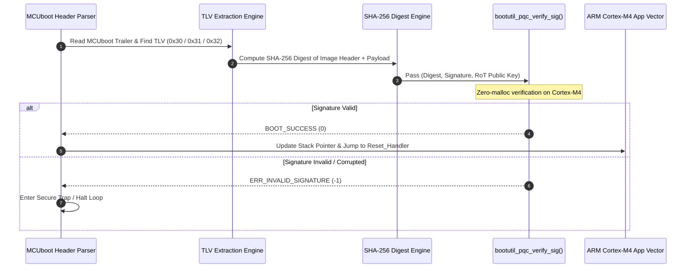

# Real-World MCUboot PQC Integration Architecture (ARM Cortex-M4)

This document provides the complete architectural design, TLV signature specification, and build system configuration for integrating NIST Post-Quantum Cryptography (ML-DSA / Dilithium, SPHINCS+, LMS) into **MCUboot** running on **ARM Cortex-M4** hardware/emulators (`mps2-an386` / `nrf52840`).

---

## 1. Target Hardware & Emulation Architecture

- **Processor Core**: ARM Cortex-M4 (ARMv7E-M architecture with DSP instructions)
- **QEMU Machine Target**: `mps2-an386` (ARM MPS2 FPGA board featuring Cortex-M4) / `lm3s6965evb`
- **Compiler Toolchain**: `arm-none-eabi-gcc` (`-mcpu=cortex-m4 -mthumb -mfloat-abi=soft`)
- **Memory Footprint**:
  - ROM/Flash Base: `0x00000000` (MCUboot image at `0x00000000`, Primary slot at `0x00020000`)
  - RAM Base: `0x20000000` (Strictly static stack allocation; 0 dynamic allocation calls)

---

## 2. PQC TLV Signature Extensions

MCUboot appends Type-Length-Value (TLV) structures to firmware images. We define three new PQC signature TLV types in `boot/bootutil/include/bootutil/image.h`:

```c
#define IMAGE_TLV_ML_DSA_44     0x30  /* FIPS 204 ML-DSA-44 (Dilithium2) Signature */
#define IMAGE_TLV_SPHINCS_PLUS  0x31  /* FIPS 205 SLH-DSA-SHA2-128f Signature      */
#define IMAGE_TLV_LMS           0x32  /* RFC 8554 LMS / LMOTS Signature            */
#define IMAGE_TLV_PQC_PUBKEY    0x38  /* Root-of-Trust PQC Public Key              */
```

---

## 3. Cryptographic Verification Pipeline



---

## 4. `imgtool.py` PQC Extension Architecture

MCUboot uses `scripts/imgtool` to format and sign binaries. We extend `imgtool` to support PQC keys:

1. **Key Generation**:
   ```bash
   python3 scripts/imgtool.py keygen -k keys/ml_dsa_44.pem -t ml-dsa-44
   ```
2. **Firmware Signing**:
   ```bash
   python3 scripts/imgtool.py sign \
       --key keys/ml_dsa_44.pem \
       --header-size 0x200 \
       --align 4 \
       --version 1.0.0+0 \
       --pad-sig \
       zephyr_app.bin signed_zephyr_app.bin
   ```

---

## 5. Execution & QEMU Verification Command

```bash
qemu-system-arm -machine mps2-an386 -cpu cortex-m4 -nographic -kernel mcuboot.bin
```

---

## 6. Real-World Roadmaps

- **Phase 1 (Current)**: MCUboot + Zephyr on ARM Cortex-M4 (`mps2-an386`).
- **Phase 2 (Upcoming)**: U-Boot FIT Image PQC authentication on RISC-V 64 / ARM.
- **Phase 3 (Following)**: UEFI EDK2 SecurityPkg PQC authentication on ARM Cortex-A multiprocessor.
