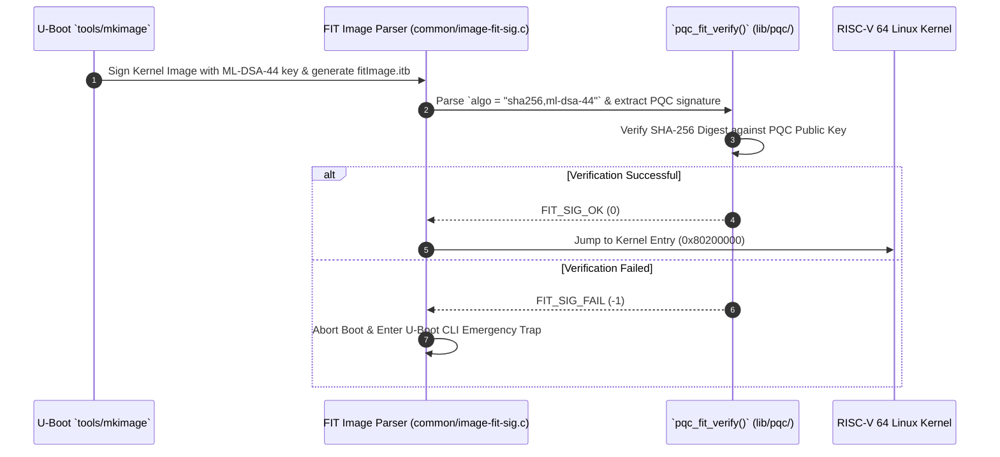

# Phase 2 Architecture: U-Boot FIT Image PQC Integration (RISC-V 64 / ARM)

This document establishes the technical design, Flattened Image Tree (FIT) schema extensions, and QEMU execution workflow for **Phase 2: Post-Quantum Cryptography (PQC) integration into U-Boot**.

---

## 1. Target Hardware & Emulation Architecture

- **Processor Target**: RISC-V 64-bit (`rv64imafdc`) & ARMv8 64-bit (`cortex-a57`)
- **QEMU Machine Target**: `qemu-system-riscv64 -M virt -cpu rv64 -nographic`
- **U-Boot Configuration**: `qemu-riscv64_defconfig` / `qemu_arm64_defconfig`
- **Image Authentication Format**: Flattened Image Tree (FIT) Device Tree Blob (`.itb`)

---

## 2. FIT Image Specification Extension (`.its` Source)

U-Boot uses `.its` device tree sources to describe kernel binaries, ramdisks, and signatures. We extend the signature algorithm node to support PQC:

```its
/dts-v1/;

/ {
    description = "PQC-Authenticated RISC-V Linux Kernel FIT Image";
    #address-cells = <1>;

    images {
        kernel-1 {
            description = "RISC-V 64 Linux Kernel";
            data = /incbin/("./Image");
            type = "kernel";
            arch = "riscv";
            os = "linux";
            compression = "none";
            load = <0x80200000>;
            entry = <0x80200000>;
            hash-1 {
                algo = "sha256";
            };
            signature-1 {
                algo = "sha256,ml-dsa-44";
                key-name-hint = "rot_pqc_key";
            };
        };
    };

    configurations {
        default = "config-1";
        config-1 {
            description = "Boot RISC-V Kernel with PQC Authentication";
            kernel = "kernel-1";
            signature-1 {
                algo = "sha256,ml-dsa-44";
                key-name-hint = "rot_pqc_key";
                sign-images = "kernel";
            };
        };
    };
};
```

---

## 3. U-Boot Architecture & Engine Hooks



---

## 4. Subagent Delegation & Execution Steps

1. **U-Boot Clone & Setup Subagent**: Clone official U-Boot repository into `./real_world/uboot` (`https://source.denx.de/u-boot/u-boot.git`).
2. **FIT PQC Engine Subagent**: Implement `lib/pqc/pqc_fit_verify.c` and extend `tools/mkimage` with PQC signature algorithm handlers.
3. **QEMU RISC-V 64 Runner Subagent**: Build `u-boot.bin` for RISC-V 64 QEMU `virt`, generate signed `.itb` FIT image, and run QEMU verification.

---

## 5. Execution Command

```bash
qemu-system-riscv64 -M virt -cpu rv64 -m 256M -nographic -bios u-boot.bin
```
