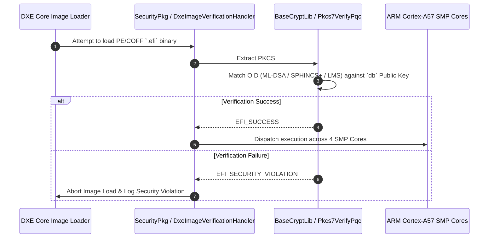

# Phase 3 Architecture: EDKII / UEFI Secure Boot PQC Integration (ARM Cortex-A SMP)

This document details the architectural design, PKCS#7 / X.509 certificate extensions, and QEMU multiprocessor execution model for **Phase 3: EDKII / UEFI Secure Boot PQC Integration**.

---

## 1. Target Hardware & Multiprocessor Architecture

- **Processor Target**: ARM Cortex-A57 64-bit (`AArch64`)
- **Multiprocessor Topology**: 4-Core SMP (`-smp 4`)
- **QEMU Machine Target**: `qemu-system-aarch64 -M virt -cpu cortex-a57 -smp 4 -m 1024M`
- **UEFI Firmware Package**: `EDKII` (`tianocore/edk2` SecurityPkg)
- **Root-of-Trust Store**: Secure NVRAM / Authenticated Variable Store (`db`, `KEK`, `PK`)

---

## 2. PQC PKCS#7 / X.509 Certificate OID Extension

UEFI Secure Boot authenticates PE/COFF EFI binaries using PKCS#7 signed data containers. We define Object Identifiers (OIDs) for PQC signature schemes in `BaseCryptLib`:

```text
id-ml-dsa-44       OBJECT IDENTIFIER ::= { 2 16 840 1 101 3 4 3 17 }  -- FIPS 204 ML-DSA-44
id-sphincs-plus    OBJECT IDENTIFIER ::= { 2 16 840 1 101 3 4 3 20 }  -- FIPS 205 SLH-DSA
id-lms-hash        OBJECT IDENTIFIER ::= { 1 2 840 113549 1 9 16 3 17 }-- RFC 8708 LMS
```

---

## 3. EDKII SecurityPkg Verification Pipeline



---

## 4. QEMU Execution Command

```bash
qemu-system-aarch64 \
    -M virt \
    -cpu cortex-a57 \
    -smp 4 \
    -m 1024M \
    -nographic \
    -pflash edk2_aarch64_code.fd
```
