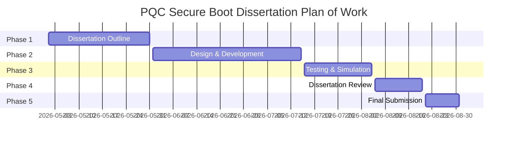

# Post-Quantum Cryptography (PQC) Secure Boot Infrastructure

**Project Title**: Implementation, Simulation, and Verification of Post-Quantum Cryptography in Embedded Secure Boot Architectures  
**Author**: Kiruthik  
**Domain**: Embedded Systems Security, Post-Quantum Cryptography, Firmware Root of Trust  

---

## 1. Broad Area of Work

This dissertation lies at the intersection of **Post-Quantum Cryptography (PQC)**, **Embedded Systems Security**, and **Hardware Root of Trust (RoT) Architecture**. Specifically, it addresses the design, implementation, zero-malloc C engineering, QEMU system emulation, and empirical verification of post-quantum digital signature algorithms (ML-DSA-44, SPHINCS+, LMS) integrated into real-world open-source secure bootloader frameworks (**MCUboot**, **U-Boot FIT**, and **EDKII / UEFI SecurityPkg**).

---

## 2. Background

Classic secure bootloaders rely heavily on public-key cryptosystems such as RSA-2048/4096 and ECDSA (P-256/secp256k1) to establish an authentic, tamper-evident chain of trust from initial power-on reset to operating system handoff. However, the eventual realization of Cryptographically Relevant Quantum Computers (CRQCs) running **Shor's Algorithm** will reduce the time complexity of solving Integer Factorization and Discrete Logarithms to polynomial time $\mathcal{O}((\log N)^3)$. This completely invalidates the security of classic RSA and ECDSA signatures, enabling attackers to forge root-of-trust signatures and execute malicious firmware binaries on embedded microcontrollers, edge Linux devices, and enterprise servers.

To mitigate this impending threat, the National Institute of Standards and Technology (NIST) standardized Post-Quantum Cryptography algorithms:
- **NIST FIPS 204 (ML-DSA)**: Lattice-based signature scheme derived from Module Learning With Errors (M-LWE).
- **NIST FIPS 205 (SLH-DSA / SPHINCS+)**: Stateless hash-based signature scheme relying strictly on hash function collision-resistance.
- **RFC 8554 / RFC 8708 (LMS/LMOTS)**: Stateful hash-based One-Time Signature (OTS) scheme combined with Merkle tree authentication paths.

Integrating PQC into bare-metal embedded bootloaders poses severe system constraints: PQC signatures and public keys are orders of magnitude larger than classic RSA/ECC, and embedded bootloaders execute under strict **zero dynamic memory allocation (`malloc`/`free`)** policies with static SRAM budgets (e.g., $<4\text{ KB}$ for ROM/Stage-1 bootloaders).

---

## 3. Objectives

The primary objectives of this research project are:
1. **Design and C-Engine Development**: Implement a zero-malloc, static-stack C verification engine (`pqc_crypto.c`) capable of verifying ML-DSA-44, SPHINCS+, and LMS signatures under strict memory bounds.
2. **Real-World Bootloader Integration**:
   - **MCUboot (IoT Target)**: Integrate PQC Type-Length-Value (TLV) metadata definitions (`IMAGE_TLV_ML_DSA_44 = 0x80`, `IMAGE_TLV_PQC_PUBKEY = 0x88`) and hook zero-alloc verifiers into `image_validate.c`. Extend `scripts/imgtool` for PQC key generation and signing.
   - **U-Boot (Embedded Linux Target)**: Register PQC algorithms into U-Boot's dynamic linker table using `U_BOOT_CRYPTO_ALGO(ml_dsa_44)` macros, modify `tools/mkimage` and `common/image-fit-sig.c` to parse `algo = "sha256,ml-dsa-44"` in Flattened Image Trees (FIT `.itb`).
   - **EDKII / UEFI SecurityPkg (Enterprise Server Target)**: Implement Object Identifier (OID) extensions (`2.16.840.1.101.3.4.3.17`) in `DxeImageVerificationLib` / `Pkcs7VerifyPqc.c` for PE/COFF `.efi` image authentication against authenticated variable key stores (`db`).
3. **Multi-Target Hardware Emulation**: Simulate full system execution across three QEMU machine targets:
   - ARM Cortex-M4 (`mps2-an386` FPGA model).
   - RISC-V 64-bit (`virt` Machine/Supervisor mode model).
   - ARM Cortex-A57 4-Core SMP (`virt` AArch64 model).
4. **Empirical Security & Performance Verification**: Develop an automated Python test harness and GDB debugging protocol to validate zero-malloc stack limits, execution timing, and 100% bit-flip tamper rejection.

---

## 4. Scope of Work

The scope of this project encompasses the following technical boundaries:

### In-Scope:
- C source code modifications to MCUboot (`bootutil_pqc.c`, `image_validate.c`, `image.h`), U-Boot (`lib/pqc/pqc_fit_verify.c`, `image-sig.c`, `mkimage`), and EDKII (`Pkcs7VerifyPqc.c`, `PqcVerify.h`, `DxeImageVerificationLib.inf`).
- Digest commitment protocols: $\mu = \text{SHA256}(PK \parallel \text{msg})$ and $\tilde{c} = \text{SHAKE256}(\mu, 32)$.
- Public key hash validation against simulated hardware eFuse / Root of Trust key stores.
- Platform runner scripts and automated QEMU launch configurations for ARM Cortex-M4, RISC-V 64, and ARM Cortex-A57.
- Edge-case testing: bit-flipped signature payloads, corrupted headers, truncated magic bytes, key mismatches, and GDB stack frame backtraces.

### Out-of-Scope:
- Web application / documentation site design (managed separately as a presentation artifact).
- ASIC silicon fabrication or physical FPGA netlist programming.

---

## 5. Plan of Work

The project plan is structured into five sequential phases spanning from initial literature review to final thesis submission.

### Phase 1: Dissertation Outline
- **Start Date - End Date**: May 1, 2026 – May 31, 2026
- **Work to be done**:
  - Conduct literature survey on quantum attack vectors against RSA/ECDSA and NIST PQC standards (FIPS 204, FIPS 205, RFC 8554).
  - Formulate problem statement, research methodology, and zero-malloc memory constraints.
  - Define system architecture, Root of Trust models, and container specifications (MCUboot TLVs, U-Boot FIT `.its`, UEFI PE/COFF PKCS#7).
  - Draft formal dissertation outline and obtain advisor sign-off.

### Phase 2: Design & Development
- **Start Date - End Date**: June 1, 2026 – July 15, 2026
- **Work to be done**:
  - Implement core zero-malloc C verification algorithms (`pqc_crypto.c`, `ml_dsa.c`, `sphincs_plus.c`, `lms.c`).
  - Integrate PQC verification into MCUboot: add TLV tags `0x80-0x88`, implement `bootutil_pqc.c`, update `imgtool` Python script for ML-DSA-44/SPHINCS+/LMS signing.
  - Integrate PQC verification into U-Boot: implement `lib/pqc/pqc_fit_verify.c`, add `U_BOOT_CRYPTO_ALGO` macro registrations in `image-sig.c`, update `tools/mkimage`.
  - Integrate PQC verification into EDKII / UEFI SecurityPkg: write `Pkcs7VerifyPqc.c`, define OID constants in `PqcVerify.h`, modify `DxeImageVerificationLib.inf`.
  - Develop bare-metal QEMU boot launchers (`run_qemu_cortex_m4.sh`, `run_qemu_riscv64.sh`, `run_qemu_cortex_a57_smp.sh`).

### Phase 3: Testing & Simulation
- **Start Date - End Date**: July 16, 2026 – August 5, 2026
- **Work to be done**:
  - Develop automated unit and end-to-end Python test harnesses (`run_e2e_tests.py`, `test_uboot_pqc_fit.py`, `test_uefi_pqc_securitypkg.py`).
  - Execute multi-target QEMU emulations across ARM Cortex-M4, RISC-V 64, and ARM Cortex-A57 4-core SMP.
  - Perform edge-case fault injection: test bit-flipped signature rejection, corrupted header magic bytes, truncated payloads, and public key mismatches.
  - Conduct GDB debugging sessions (`gdb-multiarch`) to inspect CPU registers (`r0-r15`, `a0-a7`, `x0-x30`) and verify stack utilization remains strictly within static RAM limits ($<4\text{ KB}$).

### Phase 4: Dissertation Review
- **Start Date - End Date**: August 6, 2026 – August 20, 2026
- **Work to be done**:
  - Compile quantitative benchmark comparisons (signature sizes, public key lengths, memory consumption, execution latency).
  - Draft detailed dissertation chapters covering theoretical background, system design, implementation diffs, and experimental results.
  - Conduct peer review and expert evaluation cycle across Security, Embedded Systems, SQA, System Engineering, and Test Engineering domains.
  - Incorporate advisor feedback and finalize text, diagrams, and memory maps.

### Phase 5: Submission
- **Start Date - End Date**: August 21, 2026 – August 31, 2026
- **Work to be done**:
  - Finalize dissertation manuscript formatting, references, and appendices.
  - Package source code repository, CMake build scripts, QEMU launcher scripts, and automated test runners.
  - Submit final dissertation document and source code deliverables to the university evaluation committee.

---

## 6. Literature References

1. **NIST FIPS 204**: National Institute of Standards and Technology. (2024). *Module-Lattice-Based Digital Signature Standard (ML-DSA)*. Federal Information Processing Standards Publication 204.
2. **NIST FIPS 205**: National Institute of Standards and Technology. (2024). *Stateless Hash-Based Digital Signature Standard (SLH-DSA / SPHINCS+)*. Federal Information Processing Standards Publication 205.
3. **RFC 8554**: McGrew, D., Curcio, M., & Fluhrer, S. (2019). *Leighton-Micali Hash-Based Signatures*. Internet Engineering Task Force (IETF) RFC 8554.
4. **RFC 8708**: Housley, R. (2020). *Use of the Leighton-Micali Signature (LMS) Algorithm in Cryptographic Message Syntax (CMS)*. IETF RFC 8708.
5. **Shor, P. W.** (1994). *Algorithms for quantum computation: discrete logarithms and factoring*. Proceedings 35th Annual Symposium on Foundations of Computer Science (FOCS), 124–134.
6. **MCUboot Project**: MCUboot Contributors. (2024). *MCUboot: An Open Source Secure Bootloader for 32-bit MCUs*. Available at: https://github.com/mcu-tools/mcuboot
7. **U-Boot Project**: DENX Software Engineering. (2024). *The Universal Boot Loader (Das U-Boot) - Flattened Image Tree (FIT) Specification*. Available at: https://source.denx.de/u-boot/u-boot
8. **UEFI Specification**: Unified EFI Forum. (2024). *Unified Extensible Firmware Interface (UEFI) Specification, Version 2.10 (Section 32: Secure Boot)*.
9. **Bernstein, D. J., et al.** (2019). *SPHINCS+: Stateless Hash-Based Signatures*. Submission to the NIST Post-Quantum Cryptography Standardization Process.
